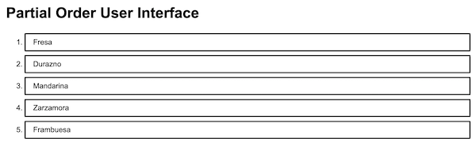

## Prior stage
[Etapa01](Etapa01.md) Setup and list item component.

## Etapa02

In this stage we add the component that will contain list items.
In the first stage, we modeled a list item as an HTML `<li>` element in
a Item component.
The container component will be an HTML `<ol>` element that has multiple
Item component children.

For a name, we could go with "PartialOrder", but that's a bit long.
We could go with "PO", but that has unfortunate usage in English,
it's a bit lacking in descriptive properties, and it's kind of short.
We could try "Order", but that has all sorts of meanings.
What to do? Perhaps "PartO" as an abbreviation? It's easy to say.
In Spanish, "parto" means delivery, as in delivering a baby.
As an unintended other meaning, that isn't bad.
The 'O' is a little awkward. It can be taken for zero '0'.
It sits out there on the end like a solitary egg, and it's awkward
to type. Let's go with "Parto".

One question is how smart to make it. Do we just make it an `<ol>`
with children and pass the children to it, or do we make it render
Item children from its properties? The second feels reasonable, because
we don't need it to be so flexible as to take any kind of children.
Nor do we want it to be. The Parto component will render Item children.

Another question is whether we model the children as properties or as state.
This is a point of confusion around React. What's appropriate for
properties vs. state? In this application, we're going to want to
have the item list laid-out according to a plan that we provide to
the container. For example, we give it [A, B, C, D] as an ordered list
of items A, B, C, D. Given [A, C, B, D] we'll want it to rerender.
Later, to complicate things, we'll want it to render [A, [D, C], B],
for example, as "A, then C and D, then B."

The [Thinking in React](https://reactjs.org/docs/thinking-in-react.html)
article from the ReactJS documentation has some useful guidance.
The list of items is static. What will change is the ordering of the list.
Things that remain static over time can best be props. State is reserved
for things that change over time. That is a simplification, but sufficient
guidance for this problem. That guidance further suggests beginning with
props and introducing state later. We'll model the list of items in the
properties.

Furthur guidance can be found in:
- [Component State](https://reactjs.org/docs/faq-state.html) from the ReactJS
  FAQ's, which explains state, with some guidance about what state is for.
- [props-vs-state](https://github.com/uberVU/react-guide/blob/master/props-vs-state.md)
  from the development guidance documentation of a startup that used ReactJS,
  has a nice chart about which use cases fit state and/or props.
- [ReactJS: Props vs. State](https://lucybain.com/blog/2016/react-state-vs-pros/)
  a blog post from Lucy Bain that works step by step through props and state,
  what they're for and how they're used.

So, for starters, Parto is a component that receives a list of itemLabel
in it's properties and renders a list of Item components wrapped in an
`<ol>` element.

One of many implementation details is that the Item components rendered
by the Parto component will need behavior injected by the `onClickEvent`
property. One way to do this is to pass an `onClickEvent` property to
Parto and have it pass that along to its child Item components.
We're skipping this for now, because we'll want the Parto component to
manage the behavior of the items. Items will behave in two different ways,
depending on whether they have yet been placed in order. We'll (eventually)
end-up with two behaviors for Parto to inject into its Item component children.

To finish-off, we do some visual work, having the App component render
a Parto component with a list of fruits. (Sorry, in Spanish.)
Seeing the result, we add some styling.
The class for the `<ol>` element rendered from the Parto component is,
`poui-parto`.

For styling, we made the `poui-parto` class render with the CSS flex
layout in a column. We removed the `display: block` property from the
`poui-item` class. These now display as numbered items in the ordered list.
In addition, we added a little top and bottom margin to them so they don't
butt up against one another. For now, we're not worrying about removing top
margin from the first and bottom margin from the last.

## Next stage
[Etapa03](Etapa03.md) Incorporate an ordering specification.
