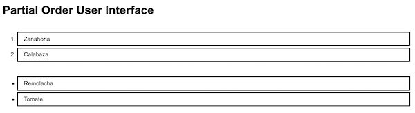

## Prior stages
- [Etapa01](Etapa01.md) setup and initial list item implementation
- [Etapa02](Etapa02.md) initial parto ordered list implementation

## Etapa03

It's time to have the Parto component display a designated ordering
of the items we give to it. For this, we'll need a way to designate the
ordering.

First, we'll have to supply keys for the items.
Then we can designate the order using the keys.
For example, given keys `"a", "b", "c"` we can provide an ordering as
`["c", "a", "b"]`.

- `["c", "a", "b"]` means first "c", then "a", then "b".
- `["a", "c"]` means first "a", then "c". Leaves "b" as not ordered
  (part of "the rest").
- `[]` means that nothing is ordered, all are part of "the rest".
- `["a"]` means first "a". Then "c" and "b" are part of "the rest".

By "the rest", we mean everything else, which come last without preference
one over the other.

Later we'll upgrade this to encompass full partial orders. For now,
it's enough to establish an order, and to distinguish "the rest" as
those that are not ordered.

So the properties we send to the Parto component need to evolve.
First, we send the itemList as tuples of form,
`{ "key": <a key>, "description": <a description> }`.
Both key and description are string valued.

We update the Parto test and component to work with the itemList as tuples.

That was the easy part. Now we add the ordering property. We want it to
default to `[]`. But more, we want the Parto component to represent two
lists: the list of what's ordered (as `<ol>`) followed by the list of
"the rest" (as `<ul>`). Both it and its tests need to evolve accordingly.

First we update the tests to look for the `<ol>` and `<ul>` parts, with
all of the items found in the `<ul>` part. We update the Parto component
to pass.

### Placing the items in order

Now we need to order the items according to the plan. So doing isn't
so much to do with the component layout, presentation, and behavior.
It's pretty useful in general, for example, we'll need it to test
the component. For that, we set-up a module, `PartialOrder`
with the needed functions.
We can test it independent of the Parto component.

We also find ourselves wanting to extract items and keys quite a bit; so,
we set-up a module, `ListItems` for that as well.

With those available, we can have the Parto component render ordered
items in the ordered list, and the rest in the unordered list.

We set-up the App to render the Parto with a partial order specification.

