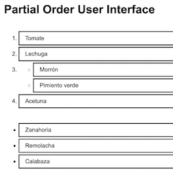
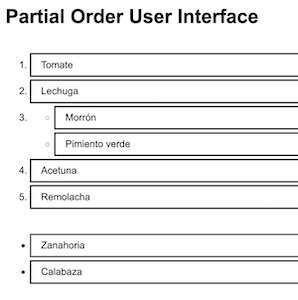

## Prior stages
1. [Etapa01](Etapa01.md) Setup and list item component.
1. [Etapa02](Etapa02.md) Implement container component.
1. [Etapa03](Etapa03.md) Incorporate an ordering specification.
1. [Etapa04](Etapa04.md) Add interaction to select items in order.

## Support full partial order

It's time to add some capability for full partial orders.
What we mean by that is this:

Given
- Zanahoria
- Remolacha
- Calabaza
- Tomate
- Lechuga
- Morrón
- Pimiento verde
- Acetuna

We want to express a preference for Tomate, and then Lechuga, and then
Morrón and Pimiento verde about the same, and then Acetuna, and then the rest.
We can represent that preference as follows:
1. Tomate
1. Lechuga
1.  - Morrón
    - Pimiento verde
1. Acetuna
1.  - Calabaza
    - Remolacha
    - Zanahoria

In which Morrón and Pimiento verde are preferred the same, but only after
Tomate and Lechuga, and always before everything else.

Recalling from [Etapa03](Etapa03.md), we represented an ordering as
an array of keys that provided the ordered items ended by an array of
everything else. We'll now use embedded arrays to represent multiple items
prefered in any given place of the order. For example, using the initial
letters as keys, we represent the above preference as:
```
['T','L',['M','P'],'A',['C','R','Z']]
```

Add a little olive oil and a dash of salt. We have a nice salad.

## Tests for full partial orders

In [Etapa03](Etapa03) we pulled a bit of a fast one when we placed a
test fixture for the ListItems module inside of the module.
We now repair that by adding a `fixtures` directory within `src`
and repairing the tests so to use it.

We also add a few more items to the fixture, which we've called `salad`,
in order to have more items to work with when specifying test orders.

In this refactoring exercise we broke a lot of tests. In order to focus
on one at a time, we extend the scripts in `package.json` to enable
the "watch" capability of Jest. And bonus, at last, we don't have to
run the tests manually with every change.

## PartialOrder

The first part of this effort is to update the `arrangeItemsPerOrder`
function in `PartialOrder` to handle the embedded array in the specified
ordering. We use a recursive function, which is more general than needed,
but still the most straightforward method.

## Parto

In the Parto component, we likewise need to recursively traverse the
embedded arrays within the ordered items. When we hit an array, we
generate a `<ul>` enclosure around the items in the array, embedded
within the outer ordered list. We likewise implement this recursively,
although we shouldn't be getting lists with more than one level of
embedding.

React gives as a little bit of a curve ball, wanting keys for the
`<ul>` lists we're embedding in the `<ol>`. We solve this by joining
together the keys of the items within the `<ul>`.

The separate rendering of the items which come last is beginning to look
and feel a bit strange. Why not render them as the final, grouped item
of the ordered list? This feels like a reasonable thing to do. The only
difference between the items in the top `ol` and the bottom `ul` of "the
rest" is the behavior we are giving to "the rest".

Because of that difference, we're holding-off making that change for now.
We're about to address additional behavior for the ordered items.
It will make sense to visit refactoring the bottom list render as part
of that task.

## Test by poking

We update the App such that it initializes with a true partial order,
just to see how it looks. And. It doesn't look right. The embedded
group isn't itself inside of a list item. This highlights the need to
verify by running the program, not only rely on tests.

The fix to the Parto component is quite straightforward, with tests
modified to check the `<ul>` embedded within an `<li>`.

Also by poking, the behavior we implemented in [Etapa04](Etapa04.md) is
no longer working. Clicking on an item in the bottom, unordered list
no longer moves it into the order.

The tests for `SelectInOrder` are passing. Refactoring them to operate
on an existing rendered partial order, rather than from the initial state,
causes them to fail.

The problem had to do with the way we were passing props from the
SelectInOrder component to the Parto component. Where before, the
SelectInOrder component didn't have a `parto` prop, with the change,
it did. The `parto` prop on the component overrode the attempt to set
it from the state. Thus, state changes didn't get passed down.
Although clicking changed the state, we still rendered from the initial props.

## Next steps

In the next stage, we'll work on the interaction some more.
We'll implement the click behavior of items after they have been
added to the ordering.

[Etapa06](Etapa06.md) Add item click interaction for partial order




