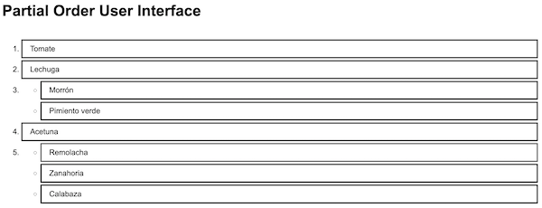

## Prior stages
1. [Etapa01](Etapa01.md) Setup and list item component.
1. [Etapa02](Etapa02.md) Implement container component.
1. [Etapa03](Etapa03.md) Incorporate an ordering specification.
1. [Etapa04](Etapa04.md) Add interaction to select items in order.
1. [Etapa05](Etapa05.md) Support full partial order.

## Add item click interaction for partial order

In this stage we'll develop some more of the click behavior on items.
We would like the behavior to be consistent and reversible.

Right now we have "the rest" in an
unordered list rendered at the bottom of the ordering. Clicking one
of them places it last in the order above.

We can generalize this to clicking an unordered item in any place
within the order. Clicking the item raises it to last before the
group in which currently appears. For example, given:

1. Tomate
1. Lechuga
1.  - Morrón
    - Pimiento verde
1. Acetuna

- Calabaza
- Remolacha
- Zanahoria

Currently clicking on "Remolacha" will update the order to:

1. Tomate
1. Lechuga
1.  - Morrón
    - Pimiento verde
1. Acetuna
1. Remolacha

- Calabaza
- Zanahoria

We would like also clicking on "Pimiento verde" to update the order to:

1. Tomate
1. Lechuga
1. Pimiento verde
1. Morrón
1. Acetuna
1. Remolacha

- Calabaza
- Zanahoria

The preference for "Pimiento verde" has been lifted-up ahead of the group
it was in (with "Morrón"), but not ahead of the items that were before
the group. The group was left with one item; therefore, it is no longer
a group. It is only the item, "Morrón".

Let's switch to a shorthand for such operations. In the above, we started
with
```['T','L',['M','P'],'A',['C','R','Z']]```

Clicking 'R' transformed to
```['T','L',['M','P'],'A','R',['C','Z']]```

Clicking 'P' transformed to
```['T','L','P','M','A','R',['C','Z']]```

What should happen when we click on an item that is by itself in the order?
It would be nice if clicking an item a second time put it back where it started.
This way the interface doesn't feel like a puzzle. It has a predictable
feeling.

Thus the opposite action, clicking an item ordered on its own, moves it down
to join with the item or group following it. Continuing the example,

Clicking 'P' again transforms to
```['T','L',['M','P'],'A','R',['C','Z']]```

Clicking 'R' transforms to
```['T','L',['M','P'],'A',['C','Z','R']]```

This is what we'll do.

## Generalize the "group click" behavior.

We arrange that clicking an item in any group lifts it above the group,
below everything that precedes the group.

The function to raise an item in an order isn't a simple one.
Rather than placing it in one of the components, even the executive
component `SelectInOrder`, we place it in the `PartialOrder` module.

The function in the `PartialOrder` module was broken down with two
helper functions, and we wrote tests for all three. This caused the
number of tests for `PartialOrder` to grow quite a bit. We broke-up
the tests into test files that take one function at a time.

### Refactoring Parto

When rendering embedded `<ul>` lists in [Etapa05](Etapa05.md) we noticed
that the rendering of "the rest" as a separate `<ul>` at the end
was special case treatment that could be generalized. The unordered
items at the end can go in the last `<li>` of the ordered list.

This makes perfect sense. If we need to render it according to the spec,
unnumbered and separated from the others, we can do it with CSS.
(However we'll revisit that as well.)

That refactoring broke a number of tests that were looking for the
separate `<ul>` component, and we repair that. But we run into another
problem as well.

### Raising fails with "the rest"

There's a disconnect between the value of the `parto` property
and the content of the list itself. Recall that the `parto` property
is the property that we use to specify the ordering of the list items.
It uses a shorthand that leaves-out the unordered items at the end of
the list. For example, "`[]`" designates nothing ordered.

Now we are using the `raiseItem` method to move elements up. We apply it
to the shorthand order specification. That shorthand does not
have the key for the item we want to raise when that item is in "the rest".
Attempting to raise an item from "the rest" fails.

One possible solution would be not to separate the order specification
from the ordered items. We've gotten a lot of benefit from keeping the
order as a separate concern, however. The functions in the `PartialOrder'
for example would be much more complicated if they had to reach inside
of items to identify and move them.

No. All we need to do is have the executive `SelectInOrder` component
fill-out the ordering so that it encompases all of the items we are rendering.
We provide an `encompassItems` method in the `PartialOrder` module to do that.

### Refactoring the arrangeItemsPerOrder function

When adding the `encompassItems` method, we notice quite a bit of parallel
with the `arrangeItemsPerOrder` method. Now that we're going to fill-out
and filter the `parto` ordering, there's no need for `arrangeItemsPerOrder`
to be so smart. A benefit is that it will be a simpler, faster function.

Fallout, however, is that the default value for the `parto` property
of the Parto component no longer works. We had set it to empty (`[]`)
and relied upon `arrangeItemsPerOrder` to fill it out. One way out is
to have `arrangeItemsPerOrder` use the `encompassItems` method to ensure
that any value for the `parto` property is properly groomed. Another is
to not allow a default for the `parto` property.

We opt for the second, because it's really nice that the `arrangeItemsPerOrder`
method can be straightforward, fast, simple. Other than this default, we can
arrange that good orderings get to the Props component. So we make the
`parto` property a required one.


## Implement lowering

Now we can implement the reverse, where clicking on an item not in a group
lowers it into a group with the item or grouped items immediately following.

First we implement `lowerItem` in PartialOrder. This turns out to be
a little bit of a messy bookeeping task. In addition, because we remove
the matched key for possible insertion with a following group, or
grouping with a following item, we have to code for a special case in which
the matched key appears by itself at the end.

Second, we use the `lowerItem` function to implement an `orderedItemClick`
in the SelectInOrder executive component.

Now we can both raise and lower an item. Each is the reverse of the other.
Clicking an item twice leaves the ordering unchanged.




You might have noted that the position of "Remolacha" is not the same in the
first and third screen shot. Both orderings are equivalent, however.
If we wanted to preserve ordering within the unordered groups, we could
add some state to the Parto component which tracks these orderings.
Whether this feature would be helpful is a question. We'll delay doing
that.

## Styling

The appearance of the partial ordering is spartan. That it takes-up the
entire width of its container is troublesome.

- limit the overall width to a maximum.
- place visual grouping around the groups
- eliminate the bullets from the groups
- round the corners of the item and group borders
- lighten the border of the items
- lighten the item backgrounds when hovered

We tried vertically aligning the numbers (`vertical-align: middle`);
however, that meant making the
`<ul>` groups display as `inline-block`. As an `inline-block` the groups
render only to the width of their content.
Some more layout fiddling, perhaps using flex or grid, might help.


## Next steps

The interface is now functionally complete, in that it is useful to specify
any ordering. Reordering items is possible, but presents a bit of a puzzle.
For example, to switch the ordering of two items, you must:
- lower the first item to be grouped with the second
- raise the second item out of the group

If you want to raise an item above a group, you have to:
- expand the group by selecting all but the last item within it
- raise the item wanted above each item that was in the group, in turn,
  by using the group and ungroup trick.
- lower the former group items back into a group

Having the ability to drag an item to any location within the ordering
will be a big help.

- [Etapa07](Etapa07.md) Add drag and drop.
