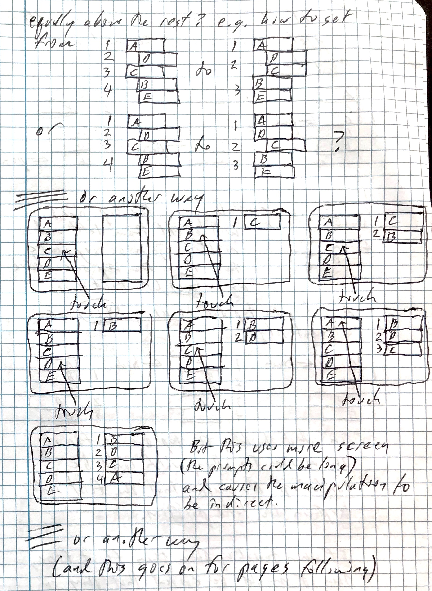
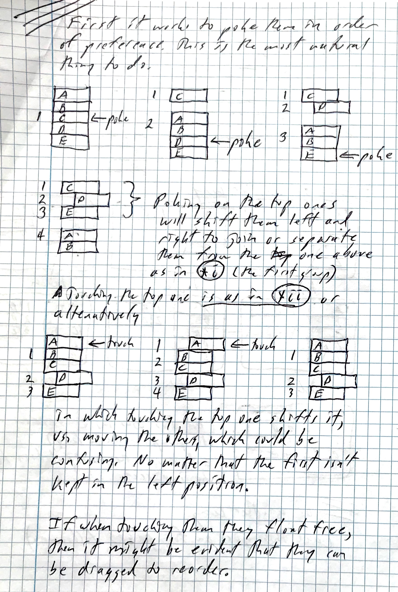
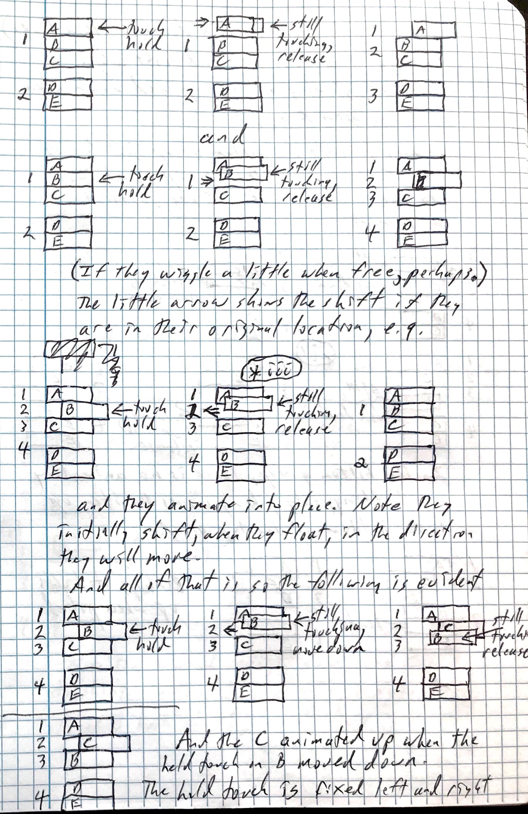
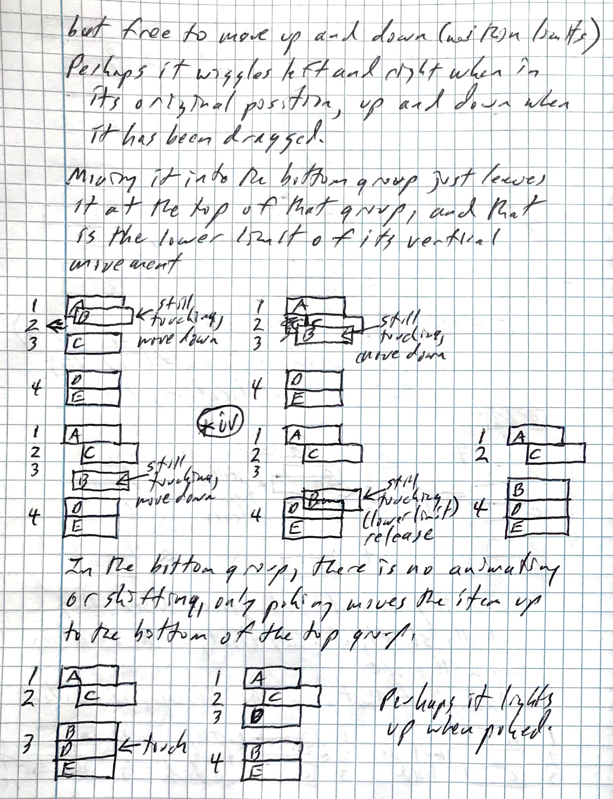
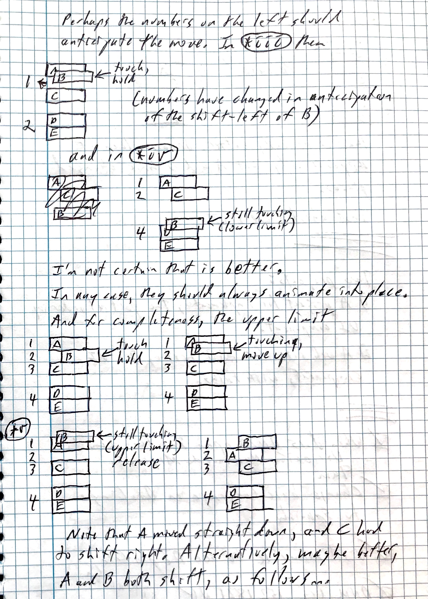
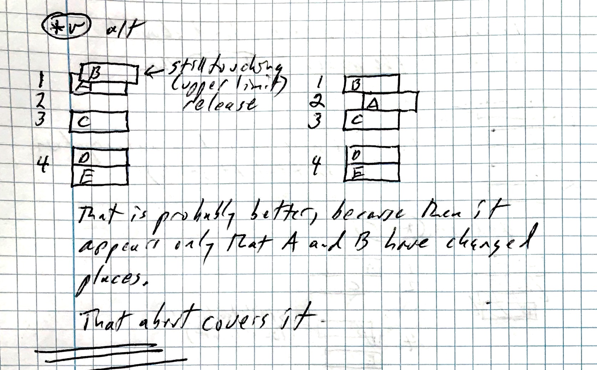

The following hand-written notes from a dated notebook
(17 February, 2019) document some
alternatives explored and an initial approach
for a user interface that enables specification of partial orders.

Its main features are:
- Using two separate groups:
    - The unordered group at the bottom, or equivalently, all items that
    group together last.
    - The ordered group above.
- In the top (ordered) group
    - Presenting a staggered list, in order of preference. The staggering
    separates individual items or item groups that have specified order.
    - Aligning items which are equivalently ordered in the partial order.
    - Clicking an item makes it move together with the item
    above it. Thus, making two items equivalent in the ordering.
    - Dragging an item will reorder it.
- In the bottom (unordered, last) group
    - Clicking an item moves it to the bottom (last) in the
    top group. Thus, choosing in order from the group creates an
    order of preference.

Additional features are:
- Enumerating the order of the items and item groups.
- Animating the items during interaction.

Here are the notes:

